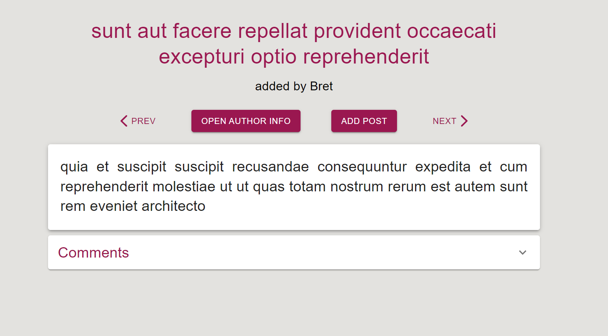
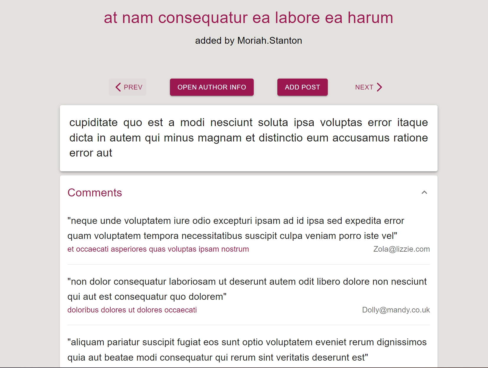
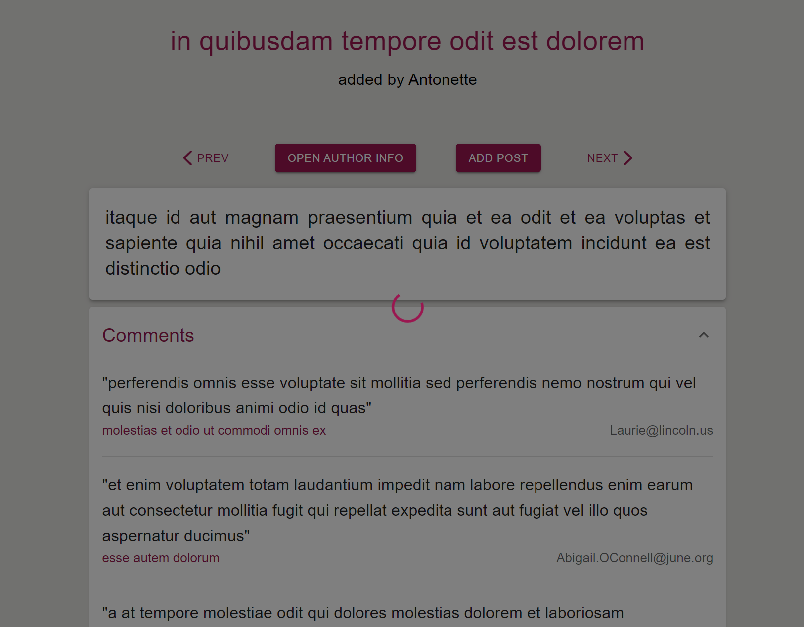
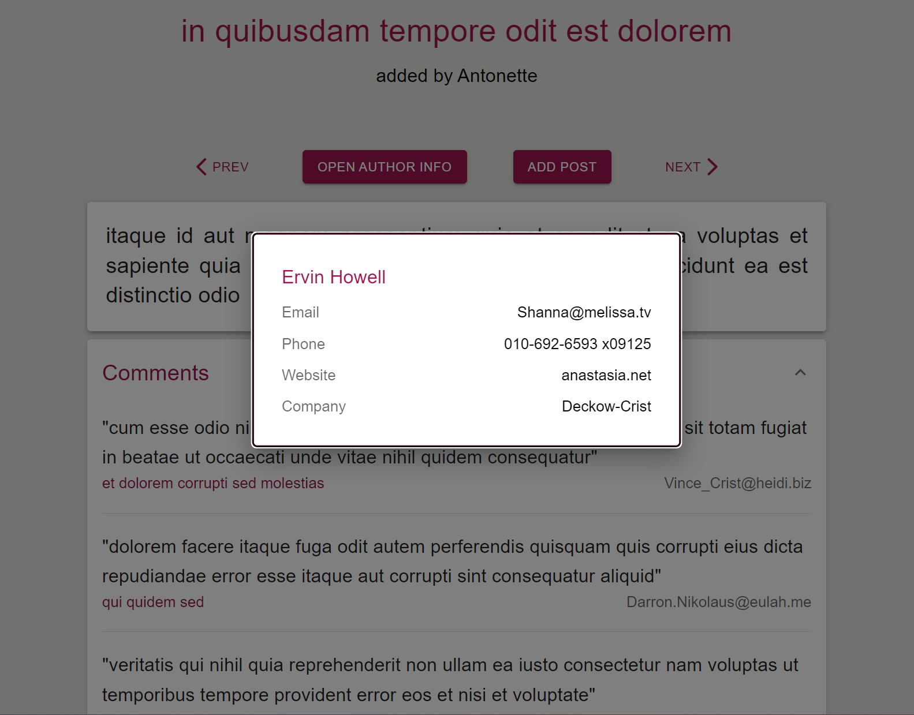
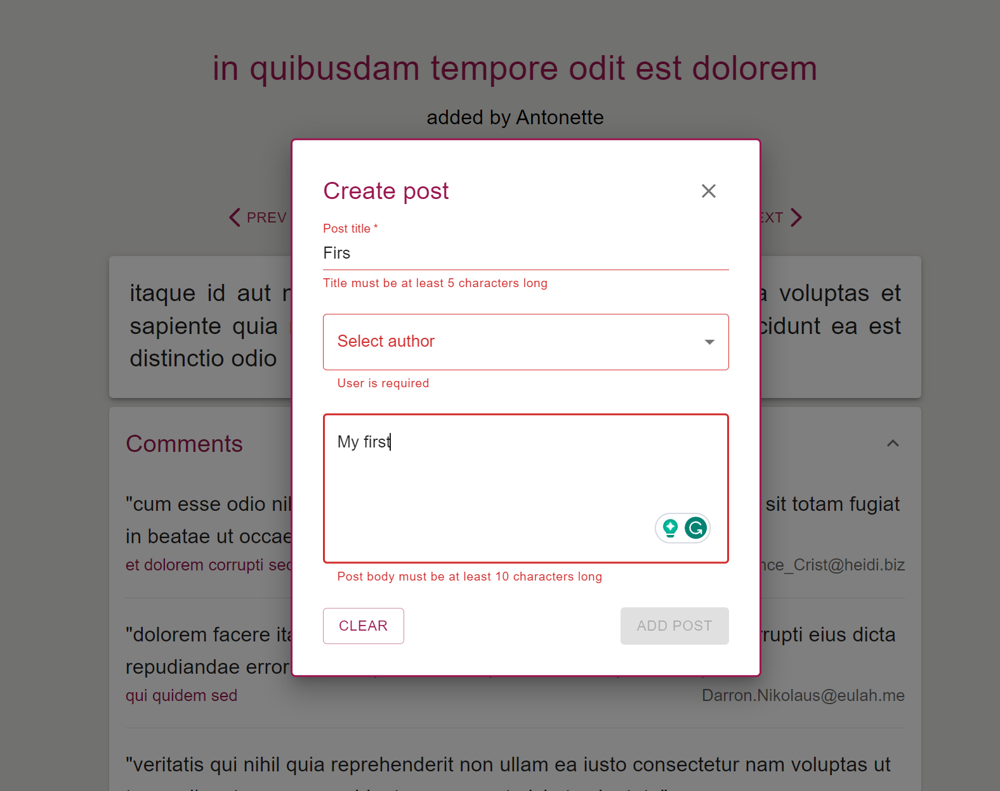
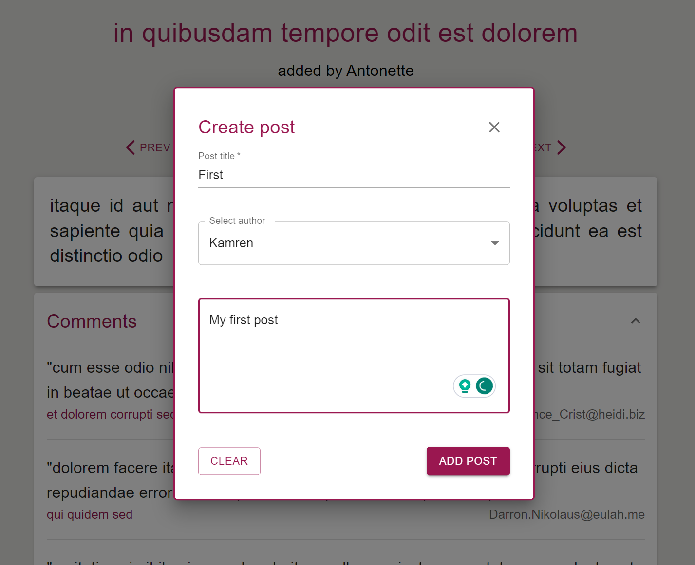
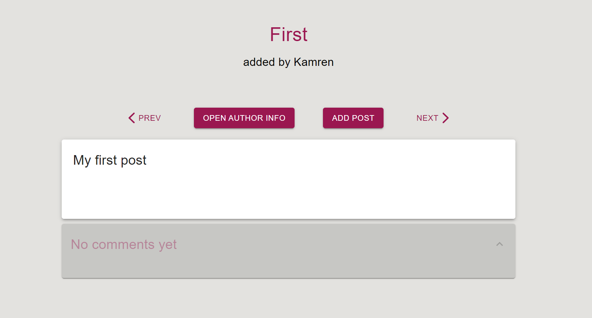
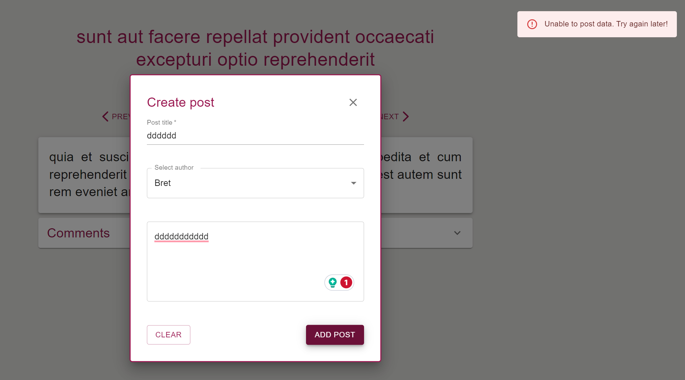

# POSTS CAROUSEL
[DEMO](https://andriimelnyq.github.io/posts-carousel/)

### Used technologies
- React + Typescript + Redux.
- [REST API](https://jsonplaceholder.typicode.com/).
- JS.
- CSS + SCSS + BEM.
- HTML.
- Additionally: MaterialUI, Validator, Axios.

### Instructions
For run it on your machine: just `fork` this repo. Then `clone` it to your computer and run `npm install` (npm i). After use `npm start`.

1. After loading the page, you can see the first post downloaded from the server with the title, author name, main buttons, and post comments:

2. You can view the comments in each post:

3. Every request to the server is accompanied by a loader:

4. You can see information about the user by clicking the OPEN AUTHOR INFO button:

5. By clicking the ADD POST button, a modal window will appear allowing you to add new posts:

6. Creating a new post will only be possible after all data has been validated:

7. New post:

8. Every bad request to the server is accompanied by a message:
